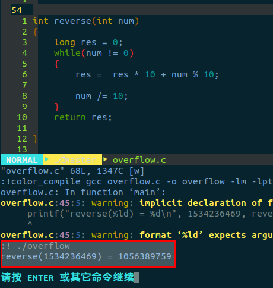
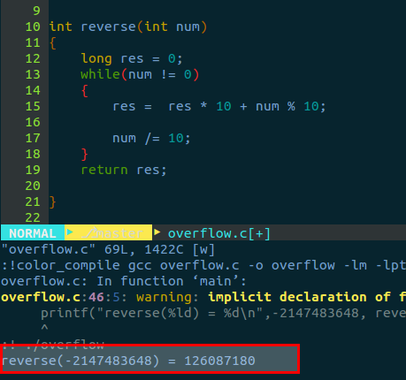

LeetCode
=======
#链接
-------

>7.Reverse_Integer (Easy)
>
>题目：https://leetcode.com/problems/Reverse-Integer/
>
>代码(github)：https://github.com/gatieme/LeetCode/tree/master/007-ReverseInteger
>
>CSDN题解；http://blog.csdn.net/gatieme/article/details/51045626
007.Reverse_Integer (Easy)

#反转一个数
-------

Reverse digits of an integer.

Example1: x = 123, return 321

Example2: x = -123, return -321

#分析

很明显，简单题，反转我们很容易写出下面的代码
```
while (x)
{
  res = res * 10 + x % 10; // 加号前面是先取得的值保持最高位, 后面则是取得原数的个位.
  x /= 10; // 裁剪原数, 确保能够从低位到高位的值, 能够被依次取得.
}
```

简单题目，我们就要看看有没有陷阱了?

#overflow问题
-------

如果给出了一个超过int表示范围的数，比如1534236469，会发生什么



这个怎么处理呢，

为了保证能准确补货溢出，将 res 设为 long, 那你一个 int 怎么反转都不会超出 long 的范围了吧?

然后判断 res 和 INT_MAX的关系就可以了.

INT_MAX宏（定义C库头文件在limits.h）
如果溢出返回0
```c
res > INT_MAX ? 0 : res;
```
#负数的问题
-------
负数这个也要注意，有两种解决办法，

*	一种方法是开始时候就判断正负，把所有的数更正为正数的情况进行处理。然后在返回时，再按照原类型返回

*	返回时，注意正负的问题

```c
fabs(res) > INT_MAX ? 0 : res;
```




#链接
-------

题目：https://leetcode.com/problems/Reverse-Integer/

代码(github)：https://github.com/gatieme/LeetCode

题解 : http://blog.csdn.net/gatieme/article/details/51045626


